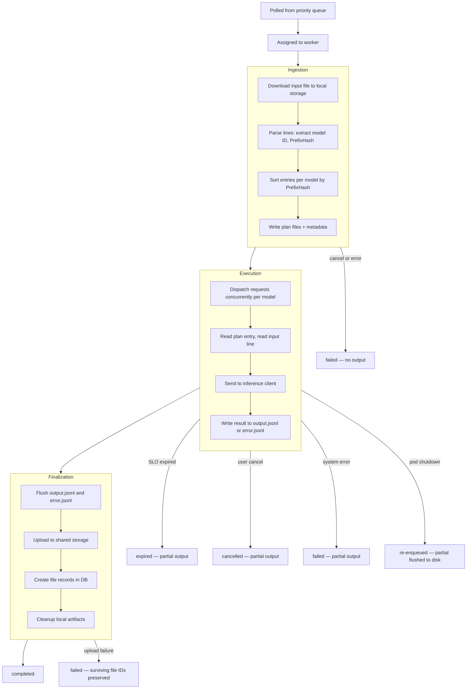
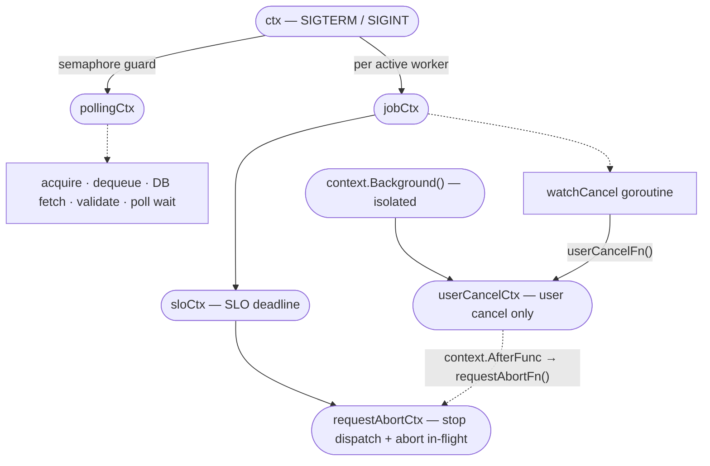
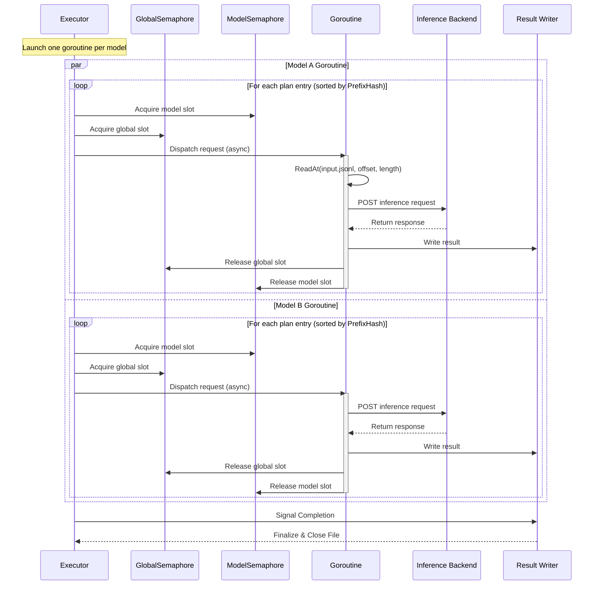

# Batch Processor Design

-   **Revision**: 7
-   **Last Updated**: 2026-04-20

-------------------------------------------------------------------

### Overview

#### Background

The batch processor is designed to execute large batch inference jobs (up to 50,000 requests per job, up to 200MB input file) while
maintaining bounded memory usage and predictable scheduling behavior.

The current design focuses on:
-   Preventing memory explosion when processing large input files
-   Enabling model-aware execution ordering
-   Ensuring fairness across models
-   Remaining deployment-agnostic (independent of GPU topology or
    backend layout)
-   Maintaining OpenAI-compatible request/response schema parity

This document describes the ingestion → execution → finalization processing architecture and scheduling model.

-------------------------------------------------------------------

### Design Goals

#### 1. Bounded Memory Usage

-   Maximum 50,000 requests per batch
-   Maximum 200MB input file
-   Memory usage must be bounded regardless of request count
-   Request bodies are never accumulated in memory

-------------------------------------------------------------------

#### 2. Model-Aware Scheduling

-   Requests targeting the same model should be grouped
-   Locality should be preserved where possible
        - Keep same model request execution (MVP)
        - Keep same endpoint group execution (TBD)
        - Keep the same execution context (TBD)
-   Avoid unnecessary churn in backend execution context

Locality is defined as executing similar work back-to-back to reuse warm state (caches, connections, scheduling context).

-------------------------------------------------------------------

#### 3. Fairness Across Models

-   No model should starve other models
-   Hot models must not monopolize execution capacity
-   Scheduling policy must prevent starvation

-------------------------------------------------------------------

#### 4. Clear Module Boundaries

Separate responsibilities into independent modules:

-   Polling
-   Validation
-   Ingestion
-   Plan storage
-   Scheduling
-   Execution
-   Result writing

Each module must be testable independently.

-------------------------------------------------------------------

#### 5. Deployment-Agnostic

-   The processor treats the inference backend as an opaque execution layer and does not assume any specific model-to-device mapping or GPU layout.

-------------------------------------------------------------------

#### 6. OpenAI Schema Parity

-   Request JSON schema parity: required
-   Response JSON schema parity: required
-   Error schema parity: required
-   Allowed API methods must match OpenAI parity
-   Functional parity: not guaranteed

Unsupported features must return OpenAI-compatible error responses.

-------------------------------------------------------------------

**Non-Goals (MVP)**

-   GPU placement or resource allocation strategies
-   Cross-job fairness (time-sliced or budget-based scheduling across multiple jobs) is not provided. Jobs are processed in a run-to-completion manner once assigned to a worker. Model-level fairness is achieved via bounded concurrent dispatch with global and per-model concurrency limits using semaphores.
-   Cost-based (token-length-aware) scheduling - cost(expected total tokens: input + max output tokens, expected execution time, GPU compute usage, memory footprint, average latency history) is not considered.
-   Advanced adaptive scheduling (e.g., latency-aware scheduling, backpressure-based throttling, token-cost-aware scheduling, dynamic budget tuning) is not provided.
-   Assumption (MVP): the priority queue provides exclusive dequeue semantics. Lease/heartbeat-based recovery for worker death is out of scope for MVP.

-------------------------------------------------------------------

#### Startup Recovery

When the processor starts, `recoverStaleJobs` scans the local work directory for job directories left behind by a previous container crash (OOM, panic, node eviction). For each stale directory it finds the corresponding DB record and takes action based on the job's status:

-   `in_progress` (no output on disk): re-enqueue the job so another worker can process it from scratch. If SLO expired, upload any surviving partial files (e.g. error.jsonl from ingestion) and mark as `expired`. If re-enqueue fails, mark as `failed`.
-   `in_progress` (output exists on disk): upload partial results and mark as `failed` (inference cost is significant — preserve completed work rather than retry from scratch).
-   `finalizing`: attempt to complete finalization (upload output). If upload fails, mark as `failed` with surviving file IDs preserved.
-   `cancelling`: upload partial results and transition to `cancelled`.
-   `validating`: re-enqueue (ingestion had not started). If SLO expired, mark as `expired` (no output files exist at this stage). If re-enqueue fails, mark as `failed`.
-   Other terminal states: clean up the directory only.

After recovery, stale directories are removed. Resume-from-checkpoint is not supported — recovered jobs are retried from scratch.

The `batch_startup_recovery_total{status,action}` metric tracks recovery outcomes for operational visibility.

--------------------------------------------------------------------
### High-Level Architecture
#### Processor and Worker
> Processor (Manager): Actively monitors the priority queue and tracks the availability of the worker pool.

> Job Dispatching: When a Worker becomes idle, the Processor claims the job and assigns it to that worker.

> Isolation: Each Worker independently handles the entire lifecycle of its assigned job, ensuring failure isolation.

#### 1. Job Lifecycle



**Ingestion**

1.  Download the input file from shared storage to local disk (`input.jsonl`)
2.  Parse each line minimally to extract the target model ID and PrefixHash
3.  Accumulate request location (offset, length) and PrefixHash in memory
4.  Sort entries per model by PrefixHash for cache-friendly dispatch ordering
5.  Write sorted plan files (one per model) and a metadata file (model map + total line count)

**Execution**

1.  One goroutine per model dispatches requests concurrently, bounded by global and per-model semaphores
2.  For each plan entry: read the input line at the recorded offset, parse, send to the inference client
3.  Write the response to `output.jsonl` (success) or `error.jsonl` (inference error)
4.  If interrupted (SLO expiry, cancel, system error): drain undispatched entries to `error.jsonl` with the appropriate error code, flush writers, and return partial counts

**Finalization**

1.  Flush buffered `output.jsonl` and `error.jsonl` to disk
2.  Upload non-empty files to shared storage (with exponential backoff retry)
3.  Create file records in DB; set `output_file_id` / `error_file_id` on the job
4.  Transition status to `completed`; cleanup local artifacts
-------------------------------------------------------------------

#### 2. State Transitions

Allowed transitions:
-   `validating` (initial state: set when a batch job is created)
-   `validating → in_progress` (after ingestion succeeds — preProcessJob completes)
-   `in_progress → finalizing` (after all plans drained)
-   `finalizing → completed` (after uploading output and error files)
-   `* → failed` (job is unable to process)
-   `validating → expired` (SLO already exceeded before execution starts — skipped at dequeue)
-   `in_progress → expired` (SLO exceeded during execution — partial results preserved)
-   `in_progress → cancelling` (set by the **API server** when user requests cancellation; the processor does not write this transition)
-   `cancelling → cancelled` (set by the **processor** after handling the cancel event)

Transient states:
-   cancelling
-   finalizing

Terminal states:
-   completed
-   failed
-   expired
-   cancelled

Transient states such as `cancelling` and `finalizing` indicate that the job has already been claimed and is being handled by an active worker. They are not eligible for reassignment. If a worker dequeues a job and finds it in `cancelling` state (e.g. the API server wrote `cancelling` between dequeue and the runnable check), the worker transitions it directly to `cancelled` so it cannot stick indefinitely. Other non-runnable transient states (e.g. `finalizing`) are skipped; queue cleanup is handled by the owning worker or system policy.

Terminal states are removed from the priority queue.

-------------------------------------------------------------------

#### 3. Context Hierarchy

The processor uses a layered context tree to propagate cancellation signals.
The critical invariant is the **fork** at `ctx`: `pollingCtx` and `jobCtx` are siblings, so cancelling the polling loop does not kill in-flight jobs.

A second critical invariant is the **isolation** of `userCancelCtx`: it is derived from `context.Background()` (not from `ctx` or `sloCtx`), so SIGTERM and SLO expiry **never** propagate into it. `userCancelCtx.Err() != nil` exclusively means the user requested cancellation via the API.



| Context | Derived from | Cancelled by | Blast radius |
|---------|-------------|-------------|--------------|
| `ctx` | (processor root) | SIGTERM / SIGINT | Everything — polling loop exits, in-flight jobs return `errShutdown` and are re-enqueued |
| `pollingCtx` | `ctx` | Semaphore double-release guard (also inherits `ctx` cancellation) | **Polling loop + pre-launch** — acquire, dequeue, DB fetch, validation, and guard re-enqueue all use `pollingCtx`. Stops accepting new jobs; running jobs unaffected. Jobs dequeued but not yet launched are re-enqueued (fallback: marked failed). |
| `jobCtx` | `ctx` | Parent `ctx` cancellation (SIGTERM / SIGINT) | Single job lifecycle (passed to `runJob`). One per active worker — up to `NumWorkers` can exist concurrently. Created only at launch commit, **after** all pre-launch checks pass. **Not** cancelled when only `pollingCtx` is cancelled (e.g. semaphore guard). |
| `sloCtx` | `jobCtx` | SLO deadline fires (`context.DeadlineExceeded`) | Propagates into `requestAbortCtx`; stops dispatch; in-flight requests finish; undispatched drained as `batch_expired` |
| `requestAbortCtx` | `sloCtx` | SLO deadline (propagated), SIGTERM (propagated via `ctx → jobCtx → sloCtx`), or `requestAbortFn()` triggered by `context.AfterFunc(userCancelCtx, requestAbortFn)` on user cancel | Stops the dispatch loop and aborts in-flight HTTP inference requests immediately |
| `userCancelCtx` | `context.Background()` | `userCancelFn()` called by `watchCancel` on user cancel **only** | User-cancel signal only — checked in error-routing paths to distinguish user cancel from SLO expiry or pod shutdown. SIGTERM and SLO expiry **do not** propagate here. |

**Design notes:**
-   The fork at `ctx` is intentional: `pollingCtx` controls the polling loop, `jobCtx` controls the job lifecycle. Cancelling `pollingCtx` (e.g. on semaphore double-release) stops new-job intake while in-flight jobs finish normally. **SIGTERM / SIGINT cancel `ctx`**, so both polling and jobs see cancellation simultaneously.
-   `requestAbortCtx` is derived from `sloCtx`, so SLO expiry and SIGTERM (via `ctx → jobCtx → sloCtx`) propagate automatically to both the dispatch loop and in-flight inference requests.
-   `userCancelCtx` is intentionally **isolated** from the `sloCtx` chain. This prevents SLO expiry or SIGTERM from being misclassified as user cancellation. Cancellation reason routing (`errCancelled` vs `errExpired` vs `errShutdown`) depends on this isolation being correct.
-   On user cancel: `watchCancel` calls `userCancelFn()` only. `requestAbortFn()` is triggered automatically via `context.AfterFunc(userCancelCtx, requestAbortFn)` wired in `runJob`, so `userCancelCtx` cancellation propagates into `requestAbortCtx` without watchCancel knowing about dispatch.
-   `watchCancel` runs in a separate goroutine and does not update DB status to `cancelling` — the API server already did that before sending the cancel event.
-   Pre-launch operations (DB fetch, conversion, expired/runnable checks) run under `pollingCtx` so they abort promptly when the guard fires. `jobCtx` is created from `jobBaseCtx` only at the moment we commit to launching `runJob`.
-   On semaphore double-release: guard cancels `pollingCtx` → pre-launch aborts or guard re-enqueue fires → `Run` returns → `main.go` sets `ready=false` → K8s removes the pod from service (readiness probe fails). If re-enqueue also fails, the job is marked failed as a terminal fallback. The pod is restarted only if a liveness probe or restart policy triggers it.

-------------------------------------------------------------------

### Process Flow
#### Ingestion
##### Objectives
-   Download input file
-   Process line-by-line
-   Avoid loading request bodies into memory
-   Build per-model execution plans stored on disk
-   Create metadata file for input file (model-filename map, total request count)

------------------------------------------------------------------------

##### Input Handling

Directory layout:
```
<WorkDir>/
└── <tenantHash>/
    └── jobs/
        └── <job_id>/
            ├── input.jsonl        # downloaded from shared storage; read-only during execution
            ├── output.jsonl       # written during execution; contains successful responses
            ├── error.jsonl        # written during execution; contains failed responses
            ├── model_map.json
            └── plans/
                ├── <safe_model_id_1>.plan
                ├── <safe_model_id_2>.plan
                └── ...
```
-   `input.jsonl` is append-only. Each line is an inference request in json format.
-   `model_map.json` provides bidirectional mapping between original model IDs and sanitized (safe) file names, plus the total request line count.
```json
{
    "model_to_safe": {
        "org/model-A:1": "org_model_A_1",
        "model-B": "model_B"
    },
    "safe_to_model": {
        "org_model_A_1": "org/model-A:1",
        "model_B": "model-B"
    },
    "line_count": 5000,
    "rejected_count": 2
}
```
-   `model_to_safe` maps original model IDs to sanitized file names used for plan files.
-   `safe_to_model` is the reverse mapping, used during execution to recover the original model ID.
-   `line_count` is stored since ingestion is the first (and only) pass over the entire input file.
-   `rejected_count` tracks requests rejected during ingestion (e.g. `model_not_found` for unregistered models). Execution seeds its failure counter from this value so that `completed + failed == total` holds.

For each `input.jsonl` line:
1.  Compute current byte offset in input.jsonl file
2.  Compute request length (including newline)
3.  Parse minimal JSON to extract model
4.  Extract and hash the system prompt content from the request body for grouping requests with identical system prompts during execution. If the system prompt is absent, the hash defaults to `NoPrefixHash` (`math.MaxUint32`), which sorts these entries last during execution.
5.  Intern modelID for plan file name
6.  Accumulate plan entry (offset, length, prefix hash) in memory per model


-------------------------------------------------------------------

##### Plan File Structure

Each model has its own plan file:

    <WorkDir>/<tenantHash>/jobs/<job_id>/plans/<safe_model_id>.plan

Incomplete files are written as:

    <safe_model_id>.plan.tmp

Renamed atomically upon completion.

- Plan entry format:

``` go
// planEntry (binary, 16 bytes per entry)
type planEntry struct {
    Offset     int64  // 8 bytes: Position in input.jsonl
    Length     uint32 // 4 bytes: Length of the JSON line
    PrefixHash uint32 // 4 bytes: FNV-32a hash of the request's system prompt (NoPrefixHash = math.MaxUint32 if absent)
}
```
The request JSON body is NOT stored in the plan.

The plan acts as an index into `input.jsonl`.

------------------------------------------------------------------------

##### Memory Characteristics

-   Plan entry ≈ 16 bytes
-   50,000 requests → ~800KB plan storage
-   Request bodies are never accumulated in memory; only lightweight plan entries (16 bytes each) are held in memory during ingestion
-   Only in-flight requests reside in memory during execution

Worst-case memory usage (processor-level):
```
Ingestion: O(totalRequestsPerJob × numWorkers) plan entries in memory (≤ 800KB per worker for 50,000 requests)
Execution: O(GlobalConcurrency) in-flight requests (shared across all workers)
```

Plan entry overhead is negligible (16 bytes each). Request bodies are never buffered.

------------------------------------------------------------------------

#### Execution
##### Execution Inputs
-   `input.jsonl`
-   Per-model plan files

Each plan file functions as a per-model execution queue.

-------------------------------------------------------------------

##### Scheduling Policy: Per-Model Goroutines with Semaphore-Based Concurrency Control

**Scheduling semantics:**
- Each model runs in its own goroutine, independently dispatching requests from its plan file.
- (Updated) There is no central round-robin scheduler or model selection loop.
- Concurrency is controlled by two levels of semaphores:
  - **Global semaphore** (`GlobalConcurrency`): limits total in-flight requests across all workers in a processor.
  - **Per-model semaphore** (`PerModelMaxConcurrency`): limits concurrent requests per individual model.
- Fairness across models is achieved naturally through goroutine scheduling and the global semaphore: no single model can monopolize all slots because each model is independently bounded by `PerModelMaxConcurrency`.

**Downstream-aware ordering:**
- Plan entries are already sorted by `PrefixHash` during ingestion.
- This groups requests with the same system prompt together, enabling the downstream llm-d Router to maximize KV prefix cache hits by routing similar requests to the same backend pod.

###### Scheduling and Execution Sequence


###### Algorithm:
1.  Executor launches one goroutine per model.
2.  Each goroutine iterates its plan entries in order (already sorted by `PrefixHash` during ingestion) and dispatches requests concurrently, subject to:
    - `PerModelMaxConcurrency` (per-model semaphore, acquired **first**: max in-flight requests per model. Protects downstream from too many requests being dumped at once)
    - `GlobalConcurrency` (global semaphore, acquired **second**: max in-flight requests across all workers. Protects system resources from unbounded goroutine growth)
    - **Acquisition order: per-model before global.** This prevents starving other models — if the goroutine blocks waiting for a global slot, only a per-model slot is held, not a global one that other models could use. Release order is LIFO (global first, then per-model).
3.  When a model's plan is fully drained, its goroutine exits.
4.  The executor waits for all model goroutines to complete before finalizing.

Goals:
-   Maximize downstream prefix cache efficiency via sorted dispatch order
-   Ensure fairness across models via bounded per-model concurrency
-   Prevent system overload via global concurrency cap

**Limitation — PrefixHash grouping (exact match only):**

The current implementation hashes the full system prompt text using FNV-32a and groups requests with identical hashes. This means only requests with **exactly the same** system prompt are grouped together — requests with **similar but not identical** prompts are not considered neighbors.

This is a known limitation. Downstream inference engines (e.g., vLLM) perform prefix matching at the token level, where even partially overlapping prompts can benefit from KV cache reuse. A more advanced approach (e.g., greedy string prefix matching or token-aware grouping) could capture these "similar prefix" cases, but adds complexity (tokenization dependency, O(n²) comparisons, etc.) that is out of scope for the MVP.

For the MVP, exact-match grouping via hashing provides a simple, O(n log n) solution that captures the most common case (many requests sharing the same system prompt verbatim) without introducing additional dependencies.

FNV-32a hash collisions (32-bit space, ~4 billion values) are theoretically possible but do not affect correctness — they only reduce grouping optimality. In practice, the number of distinct system prompts per batch is small relative to the hash space, making collisions negligible.

**Future work — similar-prefix grouping:**

A potential improvement is to sort by the system prompt string lexicographically instead of by hash. Lexicographic sorting naturally places prompts with a shared prefix adjacent to each other, which would improve KV cache hit rates for prompts that are similar but not identical. This avoids tokenization dependency (which would couple the batch gateway to model-specific tokenizers) while still capturing partial prefix overlap at the string level. The main trade-off is memory: it requires holding system prompt strings in memory during ingestion rather than just a 4-byte hash. This is tracked as a post-MVP enhancement.

-------------------------------------------------------------------

###### Concurrency Budget Terms
**Global Concurrency** (`GlobalConcurrency`): Limits total in-flight inference calls across all workers in a processor. Protects system resources (goroutines, sockets, memory) from unbounded growth as models and jobs scale.
    - Default: 100
**Per-Model Concurrency** (`PerModelMaxConcurrency`): Limits concurrent execution per model. Protects downstream llm-d Router from being overwhelmed by a single model's requests.
    - Default: 10

-------------------------------------------------------------------

###### Input File Access
Concurrent access to `input.jsonl` must be safe.

Approaches:
-   Use `ReadAt` using offset
-   Per-worker file descriptors
-   Synchronization around file reads

-------------------------------------------------------------------
### Module Boundaries

#### Poller
-   Dequeue jobs from priority queue
-   Delete jobs from queue if not runnable
-   Fetches job Database item

#### Validator
-   Validate job state (if runnable, expired)
-   Check SLO

#### Planner
-   Download input
-   Build per-model plans (accumulate entries in memory)
-   Sort plan entries by PrefixHash for downstream optimization
-   Write sorted plan files to disk
-   Create metadata file
-   Provide plan readers

#### Scheduler
-   Per-model goroutine lifecycle management
-   Global and per-model concurrency control via semaphores

#### Executor
-   Read request via offset/length
-   Resolve per-model inference client via `GatewayResolver`
-   Call inference backend
-   Return result

###### Gateway Routing
The processor supports two mutually exclusive gateway modes. Exactly one must be configured; `Validate()` enforces this at startup.

**Global mode** routes all inference requests to a single endpoint, regardless of model name. Use this for MaaS platforms, multi-model gateways, or LoRA-only deployments where all adapters share a single vLLM instance:

```yaml
global_inference_gateway:
  url: "http://llm-d-router:8000"
  request_timeout: "5m"
  max_retries: 3
  initial_backoff: "1s"
  max_backoff: "60s"
```

**Per-model mode** maps specific model names to individual gateway endpoints. Only models listed here are routed; requests for unlisted models receive a request-level `model_not_found` error:

```yaml
model_gateways:
  "llama-3":
    url: "http://gateway-a:8000"
    request_timeout: "5m"
    max_retries: 3
    initial_backoff: "1s"
    max_backoff: "60s"
  "mistral":
    url: "http://gateway-b:8000"
    api_key_name: "gateway-b-api-key"
    request_timeout: "2m"
    max_retries: 1
    initial_backoff: "1s"
    max_backoff: "30s"
```

Each per-model entry must be fully specified — there is no inheritance between entries. The optional `api_key_name` identifies a key within the mounted app secret (`/etc/.secrets/`), and `api_key_file` reads from an arbitrary path. TLS fields (`tls_insecure_skip_verify`, `tls_ca_cert_file`, `tls_client_cert_file`, `tls_client_key_file`) are also optional. For mounting CA and client certificates in Kubernetes and setting Helm values end-to-end, see [Processor inference TLS](../guides/processor-inference-tls.md).

`GatewayResolver` (in `pkg/clients/inference/inference_client_resolver.go`) manages the client pool. `NewGlobalResolver` creates a single client for all models; `NewPerModelResolver` creates per-model clients, sharing instances when settings are identical to reuse connection pools.

#### ResultWriter

-   Write successful responses to `output.jsonl`
-   Write failed responses to `error.jsonl`
-   Update metrics
-   Finalize job (upload non-empty files, set `output_file_id` / `error_file_id` on job record)

-------------------------------------------------------------------
### Failure Handling

#### SLO Expiration

The `completion_window` field on a batch job defines the deadline by which the job must complete. This is stored as `expires_at` (Unix timestamp) and used as the SLO enforcement boundary.

**Behavior follows the OpenAI Batch API spec:**

> *"Batches that do not complete in time eventually move to an `expired` state; unfinished requests within that batch are cancelled, and any responses to completed requests are made available via the batch's output file."*
> — [OpenAI Batch API: Batch expiration](https://platform.openai.com/docs/guides/batch#batch-expiration)

Concretely:

-   Requests that completed before expiration → written to `output.jsonl`, preserved in output file
-   Requests that did not execute before expiration → written to `error.jsonl` with error code `batch_expired`:
    ```jsonl
    {"id": "batch_req_...", "custom_id": "...", "response": null, "error": {"code": "batch_expired", "message": "This request could not be executed before the completion window expired."}}
    ```
-   Job status → `expired` with `expired_at` timestamp set

**Implementation:**

SLO is enforced via `context.WithDeadline(ctx, slo)` on the job execution context. When the deadline fires:
1.  New request dispatch stops — semaphore acquisition fails on the expired context, breaking the dispatch loop
2.  In-flight inference requests that complete (even after the deadline fires) are written to the **output** file with whatever response the inference client returns — SLO expiry does not overwrite in-flight results. Requests where the inference call itself fails due to context cancellation are written to the output file with the HTTP error response from the backend.
3.  Requests that were never dispatched (pending in the plan but not yet started) are drained to the error file as `batch_expired`
4.  Requests that already completed successfully remain in the output file

The job then transitions directly `in_progress → expired` (no `finalizing` transient state).

**Why not configurable?**

An earlier design considered making expiration behavior configurable (continue vs. stop on SLO breach). This was dropped in favor of strict OpenAI spec alignment: the `expired` state and its semantics are well-defined in the OpenAI API, and diverging from them would break client expectations. Partial results are always preserved.

#### Partial Output Preservation

This is an extension of the OpenAI Batch API — OpenAI discards results when a batch is cancelled or fails. We preserve them because completed inference results are expensive to produce and should not be thrown away.

For all terminal states where work was interrupted (expired, cancelled, failed), any completed inference results are preserved in the output file, and unexecuted requests are recorded in the error file with the appropriate error code (`batch_expired`, `batch_cancelled`, `batch_failed`). `batch_expired` is defined by the OpenAI spec; `batch_cancelled` and `batch_failed` are our extensions.

**Path-by-path behavior:**

-   **Expired (SLO deadline)**: Undispatched requests are drained as `batch_expired`, partial output is uploaded, status transitions to `expired`. (OpenAI spec behavior.)
-   **Cancelled (user-initiated)**: In-flight requests complete, undispatched requests are drained as `batch_cancelled`, partial output is uploaded, status transitions to `cancelled`.
-   **Failed (execution system error)**: Undispatched requests are drained as `batch_failed`, partial output is uploaded, status transitions to `failed`.
-   **Failed (ingestion)**: No output files exist — nothing to preserve. Status transitions to `failed` without file IDs.
-   **Failed (finalization — upload failure)**: Upload retries (exponential backoff) are exhausted inside `finalizeJob`. The two uploads (output and error files) run independently — a failure in one does not cancel the other. The job is marked `failed` with whatever file IDs survived, so the successfully-uploaded artifact remains reachable via the API (`errFinalizeFailedOver`). If the terminal DB write itself fails after uploads succeeded, the fallback also preserves file IDs.
-   **Graceful shutdown (pod termination)**: Output and error writers are flushed to disk before returning `errShutdown`. The job is re-enqueued for another worker. If re-enqueue fails, partial results are uploaded and the job is marked `failed` with file IDs (`handleFailed` with non-nil `jobInfo`). On container restart with emptyDir intact, startup recovery can also upload partial output from the flushed files.

Partial upload in error handlers (`handleExpired`, `handleCancelled`, `handleFailed`) is best-effort: upload failures are logged but do not block the terminal status transition. In contrast, `finalizeJob` (the happy-path finalization) treats upload failures as hard errors and falls back to `failed` status with surviving file IDs (`errFinalizeFailedOver`).

---

-   Worker crash during plan build → incomplete `.tmp` files discarded
-   Atomic rename ensures plan integrity
-   Inference failure handled per request
-   Job-level failure only on systemic error

-------------------------------------------------------------------
### Observability

#### Tracing (OpenTelemetry)

The root `"process-batch"` span covers the full job lifecycle (ingestion → execution → finalization). Additional child/linked spans provide finer-grained visibility:

| Span | Parent | Description |
|------|--------|-------------|
| `process-batch` | apiserver trace (linked via propagated trace context) | Root span for the entire job lifecycle |
| `storage.Store` | `process-batch` (during ingestion), `finalize` / `handle-cancelled` / `handle-expired` / `handle-failed` (during terminalization) | File upload to shared storage (S3/filesystem) |
| `storage.Retrieve` | `process-batch` (during ingestion) | File download from shared storage |
| `storage.Delete` | `process-batch` (during cleanup) | File deletion from shared storage |
| `finalize` | Detached (linked to `process-batch`) | File uploads and final DB status write for completed jobs; uses `DetachedContext` so SIGTERM cannot abort the operation |
| `handle-cancelled` | Detached (linked to `process-batch`) | Partial upload and cancelled status write; uses `DetachedContext` so SIGTERM cannot abort the operation |
| `handle-expired` | Detached (linked to `process-batch`) | Partial upload and expired status write; uses `DetachedContext` so SIGTERM cannot abort the operation |
| `handle-failed` | Detached (linked to `process-batch`) | Optional partial upload (when `jobInfo` is non-nil), failed status write, and cleanup; uses `DetachedContext` so SIGTERM cannot abort the operation |
| `re-enqueue` | Detached (linked to `process-batch`) | Best-effort re-enqueue after failure; uses `DetachedContext` so it survives parent cancellation |

The `process-batch` span records the following attributes:

| Attribute | Type | Set at | Description |
|---|---|---|---|
| `batch.id` | string | span start | Batch ID |
| `tenant.id` | string | span start | Tenant ID |
| `file.id` | string | span start | Input file ID |
| `batch.output_file.id` | string | Any terminal state with partial output | Output file ID; set on completed, expired, cancelled (execution), and failed (execution) |
| `batch.error_file.id` | string | Any terminal state with partial output | Error file ID; set on completed, expired, cancelled (execution), and failed (execution) |
| `batch.request.total` | int64 | Any terminal state after execution | Total request count |
| `batch.request.completed` | int64 | Any terminal state after execution | Successfully completed request count |
| `batch.request.failed` | int64 | Any terminal state after execution | Failed request count |

Errors at each stage are recorded via `span.RecordError()` and `span.SetStatus(codes.Error, ...)`.

Tracing is disabled when `OTEL_EXPORTER_OTLP_ENDPOINT` is not set (no-op provider).

-------------------------------------------------------------------

#### Metrics

**Job-Level Metrics**

- `jobs_processed_total{result,reason}` (counter)
  Tracks total number of jobs processed with result classification:
  - `success`
  - `failed`
  - `skipped`
  - `re_enqueued`
  - `expired`

  Reasons include:
  - `system_error`
  - `guard_shutdown` — semaphore double-release guard triggered graceful shutdown; job re-enqueued
  - `db_transient`
  - `db_inconsistency`
  - `not_runnable_state`
  - `expired_dequeue` — SLO already exceeded before execution started
  - `expired_execution` — SLO deadline fired during execution; partial results preserved
  - `none` — no additional reason beyond the result (e.g. success, cancelled)

- `job_processing_duration_seconds{size_bucket}` (histogram)
  Measures total job processing duration (end-to-end, including ingestion and execution).

- `job_queue_wait_duration_seconds` (histogram)
  Measures how long a job waited in the priority queue before being picked up.

**Worker Utilization Metrics**

- `total_workers` (gauge)
  Total configured worker count (static; set during initialization).

- `active_workers` (gauge)
  Current number of workers actively processing jobs.

- `processor_inflight_requests` (gauge)
  Global number of in-flight inference requests across all workers (bounded by `GlobalConcurrency`).
  Primary saturation signal for scheduler/executor health.

- `processor_max_inflight_concurrency` (gauge)
  Configured `GlobalConcurrency` value. Used with `processor_inflight_requests` to compute utilization.

- `model_inflight_requests{model}` (gauge)
  Per-model in-flight request count (bounded by `PerModelMaxConcurrency`).

**Duration Metrics**

- `plan_build_duration_seconds{size_bucket}` (histogram)
  Measures ingestion and plan build duration.

- `model_request_execution_duration_seconds{model}` (histogram)
  Measures per-request execution duration.

**Error and Retry Metrics**

- `request_errors_by_model_total{model}` (counter)
  Counts inference request errors grouped by model.

- `file_storage_operations_total{operation,component,status}` (counter)
  Counts file storage operations by outcome. `operation` is `store`/`retrieve`/`delete`,
  `component` is `processor`/`apiserver`/`garbage-collector`, and `status` is
  `success` (operation completed), `retry` (retry attempt), or `exhausted`
  (all retries failed). Emitted by the `retryclient` decorator.

**Token Metrics**

- `batch_request_prompt_tokens_total{model}` (counter)
  Total prompt tokens consumed by batch inference requests. Only counted when the inference response includes usage data. Streaming is rejected at ingestion, so non-streaming responses from OpenAI-compatible backends typically include this.

- `batch_request_generation_tokens_total{model}` (counter)
  Total generation (completion) tokens produced by batch inference requests. Same availability caveat as prompt tokens.

**Job Lifecycle Metrics**

- `batch_job_e2e_latency_seconds{status}` (histogram)
  End-to-end job latency from submission (`created_at`) to terminal state. `status` values: `completed`, `cancelled`, `expired`, `failed`. Includes queue wait time — for processor-only duration, use `job_processing_duration_seconds`.

**Cancellation Metrics**

- `batch_cancellation_total{phase}` (counter)
  Total batch job cancellations by phase. `phase` values: `queued` (cancelled before execution started), `in_progress` (cancelled during execution), `finalizing` (cancelled during file upload/finalization).

**Startup Recovery Metrics**

- `batch_startup_recovery_total{status,action}` (counter)
  Counts jobs recovered during processor startup after a container restart.
  - `status`: the recovered job status at the time recovery ran. Common values include `in_progress`, `finalizing`, `cancelling`, `validating`, and `unknown` when the DB lookup failed or no DB record existed.
  - `action`: the recovery action taken. Values include `re_enqueued`, `failed`, `finalized`, `cancelled`, `expired`, `cleaned_up`, and `error`.
  Non-zero values indicate container-level crashes (OOM, panic) or stale on-disk artifacts from a prior processor instance.
